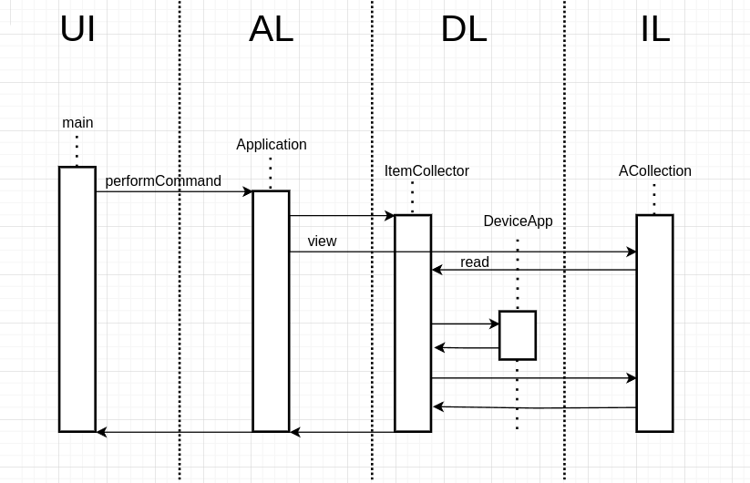

Министерство науки и высшего образования Российской Федерации  
Федеральное государственное бюджетное образовательное учреждение  
высшего образования  
«Московский государственный технический университет  
имени Н.Э. Баумана  
(национальный исследовательский университет)»  
(МГТУ им. Н.Э. Баумана)

ФАКУЛЬТЕТ ИНФОРМАТИКА И СИСТЕМЫ УПРАВЛЕНИЯ  
КАФЕДРА КОМПЬЮТЕРНЫЕ СИСТЕМЫ И СЕТИ (ИУ6)

 

ОТЧЕТ  
к лабораторной работе №1  
по дисциплине "Современные технологии разработки  
программного обеспечения"  
Реализация приложения в многоуровневой архитектуре  
с использованием удалённого репозитория кода

 

Преподаватель: Фетисов М.В.

Студенты группы ИУ6-51Б Погосян Абраам, Селянинов Дмитрий, Архипов Иван.

## Описание задания

Задача № 18: "Магазин приложений".

Вариант задания № 6: Постройте диаграмму последовательности выполнения команды view. Диаграмма должна показывать прохождение выполнения команды между программными объектами, расположенными в соответствующих слоях многоуровневой архитектуры.

## Адрес проекта

Проект хранится в репозитории по адресу: [https://gitlab.bmstu.ru/msdt/2024/iu6-51b-dsselayninov-iaarkhipov-agpogosyan/l-1](https://gitlab.bmstu.ru/msdt/2024/iu6-51b-dsselayninov-iaarkhipov-agpogosyan/l-1).

## Документация 

[Диаграммы классов](https://l-1-c676a0.gitlab.bmstu.ru:8443/annotated.html).

[Отчёт о покрытии тестами](https://l-1-c676a0.gitlab.bmstu.ru:8443/coverage/).

## Диаграмма последовательности

Последовательность выполнения команды view:

## Выводы
- В процессе выполнения лабораторной работы были изучены понятия изоляции предметной области и многоуровневой архитектуры.
- С использованием полученных знаний была разработана программа на языке C++.
- Были приобретены навыки отображения предметной области в виде диаграммы последовательностей.
